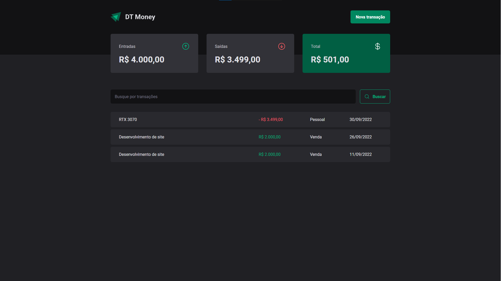
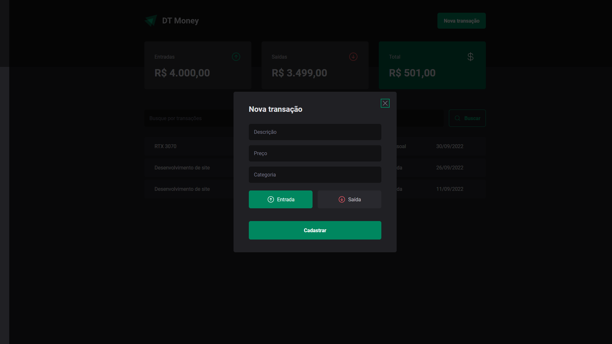

# DT Money

É um projeto desenvolvido durante um treinamento de programação da Rocketseat 2022, tem como objetivo o gerenciamento
de entradas e saidas de dinheiro.




### Tech

- vite
- React
- Typescript

### Executar

```bash
$ npm install

$ npm run dev:server
#http://localhost:3000/transactions

$ npm run dev
#http://localhost:5173
```
